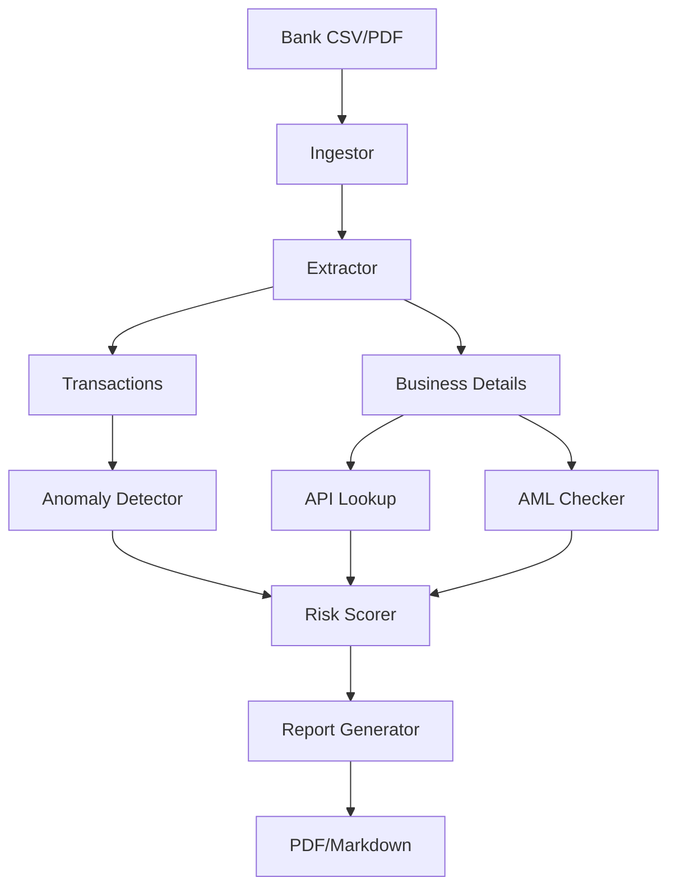

# Agent Workflow

## Agent Collaboration Overview

The AI Fraud Detection Agent system consists of **7 specialized autonomous agents** orchestrated by the FastAPI backend. Each agent has a single responsibility and communicates via structured JSON messages.

---

## Agent Definitions

### 1. Document Ingestor Agent

**Module:** `src/agents/document_ingestor.py`

**Role:** Ingests raw files (PDF/CSV) and converts them to structured data.

**Input:**
```python
file_path: str  # Path to .csv or .pdf file
```

**Output:**
```python
{
  "format": "csv" | "pdf",
  "file_path": str,
  "data": List[Dict] | None,  # For CSV
  "text": str | None,         # For PDF
  "row_count": int,
  "columns": List[str] | None
}
```

**Tools:**
- `pandas.read_csv()` for CSV
- `pytesseract.image_to_string()` + `pdf2image` for PDF OCR

**Example:**
```python
ingestor = DocumentIngestor()
result = ingestor.ingest_file("data/statement.csv")
# → {"format": "csv", "data": [{"transaction_id": 1, ...}, ...]}
```

**State:** Stateless – pure function, no internal state.

---

### 2. Data Extractor Agent

**Module:** `src/agents/data_extractor.py`

**Role:** Extracts key fields (transactions, ABN, business name) from ingested data.

**Input:**
```python
parsed_data: Dict  # Output from DocumentIngestor
```

**Output:**
```python
{
  "transactions": List[Dict],  # Standardized transaction records
  "business_details": Dict,    # {name, abn, addresses}
  "abn": str,
  "business_name": str,
  "addresses": List[str],
  "source": "csv" | "pdf"
}
```

**Techniques:**
- **CSV:** Column mapping + type conversion
- **PDF:** Regex extraction (ABN: `\d{11}`, dates, amounts)

**Example:**
```python
extractor = DataExtractor()
extracted = extractor.extract(ingested_data)
# → {"transactions": [{"transaction_id": 1, "amount": 50000.0, ...}], ...}
```

**State:** Stateless.

---

### 3. API Lookup Agent

**Module:** `src/agents/api_lookup_agent.py`

**Role:** Validates business details via external APIs (mock ABR/ATO for demo).

**Input:**
```python
abn: str
business_name: str
```

**Output:**
```python
{
  "valid": bool,
  "abn": str,
  "name": str,
  "status": "Active" | "Inactive" | "Cancelled",
  "registration_date": str,
  "address": str,
  "entity_type": str,
  "message": str
}
```

**Endpoints Called:**
- `GET /abr?abn={abn}&name={name}` → ABR validation
- `GET /ato?abn={abn}&financial_year=2025` → Tax return verification

**Example:**
```python
lookup = APILookupAgent()
result = lookup.lookup_business("123456789", "Acme Pty Ltd")
# → {"valid": True, "status": "Active", ...}
```

**State:** Stateless.

---

### 4. Anomaly Detector Agent

**Module:** `src/agents/anomaly_detector.py`

**Role:** Flags numerical and pattern-based anomalies using PyOD Isolation Forest.

**Input:**
```python
transactions: List[Dict]  # From DataExtractor
```

**Output:**
```python
[
  {
    "type": "outlier" | "round_dollar" | "high_value",
    "transaction_id": int,
    "amount": float,
    "severity": "low" | "medium" | "high",
    "message": str
  },
  ...
]
```

**Detection Logic:**
1. **Isolation Forest** (PyOD) – statistical outlier detection
2. **Round-dollar rule** – `amount % 1000 == 0` and `amount >= 1000`
3. **High-value rule** – `amount > 250000`

**Example:**
```python
detector = AnomalyDetector(contamination=0.1)
anomalies = detector.detect_anomalies(transactions)
# → [{"type": "round_dollar", "transaction_id": 3, "amount": 10000.0, "severity": "high", ...}]
```

**State:** Maintains fitted Isolation Forest model after `fit()`.

---

### 5. AML Checker Agent

**Module:** `src/agents/aml_checker.py`

**Role:** Screens transactions and business details for AML red flags.

**Input:**
```python
transactions: List[Dict]
business_details: Dict
```

**Output:**
```python
[
  {
    "type": "high_risk_jurisdiction" | "watchlist_entity" | ...,
    "transaction_id": int | None,
    "severity": "medium" | "high",
    "message": str,
    "detail": str (optional)
  },
  ...
]
```

**Screening Logic:**
- Jurisdiction in `aml_watchlist.json` → `high_risk_jurisdiction`
- Business name in watchlist → `watchlist_entity`
- ABN in watchlist → `watchlist_abn`
- Address contains shell indicators → `shell_company_indicator`
- Amount $9k-10k (sub-reporting) → `possible_structuring`

**Example:**
```python
aml = AMLChecker()
alerts = aml.check_transactions(transactions, business_details)
# → [{"type": "high_risk_jurisdiction", "transaction_id": 10, "severity": "high", ...}]
```

**State:** Loads watchlist JSON at init.

---

### 6. Risk Scorer Agent

**Module:** `src/agents/risk_scorer.py`

**Role:** Aggregates anomalies and AML alerts into a composite risk score with APRA fields.

**Input:**
```python
anomalies: List[Dict]      # From AnomalyDetector
aml_alerts: List[Dict]     # From AMLChecker
```

**Output:**
```python
{
  "score": int,              # 0-100
  "category": "Low" | "Medium" | "High",
  "breakdown": {
    "round_dollar_points": int,
    "outlier_points": int,
    "high_value_points": int,
    "aml_points": int,
    "total_points": int
  },
  "apra_fields": {
    "asset_classification": "Standard" | "Substandard" | "Doubtful" | "Loss",
    "impairment_provision": float,
    "regulatory_code": "APS222-001" | ...,
    "collateral_value": float,
    "loan_to_value_ratio": float,
    "requires_manual_review": bool,
    "review_priority": "Low" | "Medium" | "High"
  }
}
```

**Scoring Table:**

| Anomaly | Base Points | Severity Modifier |
|---------|-------------|-------------------|
| Round-dollar | +20 | — |
| Outlier (med) | +15 | ×1.5 if >$50k |
| High-value | +25 | — |
| AML (high) | +40 | — |
| AML (med) | +15 | — |
| Shell company | +25 | Additional to AML |

**Example:**
```python
scorer = RiskScorer()
risk = scorer.calculate_score(anomalies, aml_alerts)
# → {"score": 85, "category": "High", "apra_fields": {...}}
```

**State:** Stateless.

---

### 7. Report Generator Agent

**Module:** `src/agents/report_generator.py`

**Role:** Compiles all agent outputs into audit-ready PDF and Markdown reports.

**Input:**
```python
risk_data: Dict        # From RiskScorer
anomalies: List[Dict]  # From AnomalyDetector
aml_alerts: List[Dict] # From AMLChecker
business_details: Dict # From DataExtractor
task_id: str
format: "pdf" | "markdown"
```

**Output:**
```python
{
  "report_path": str,
  "report_url": str,
  "format": str,
  "generated_at": str,
  "filename": str
}
```

**Report Sections:**
1. **Executive Summary** – Risk score, category, key stats
2. **APRA Fields Table** – All compliance fields
3. **Anomalies Table** – Details of flagged transactions
4. **AML Alerts** – Risk alerts with severity
5. **Risk Gauge Visualization** – Matplotlib chart
6. **Disclaimer** – Demo notice

**Example:**
```python
reporter = ReportGenerator(output_dir="reports/")
report = reporter.generate_report(risk_data, anomalies, alerts, business, "abc123", "pdf")
# → {"report_path": "reports/audit_abc123.pdf", ...}
```

**State:** Maintains output_dir.

---

## Orchestration Flow

The FastAPI backend (`src/app/main.py`) coordinates agents:

```python
def process_files(bank_path, tax_path, task_id):
    # 1. Ingest
    bank_raw = document_ingestor.ingest_file(bank_path)
    tax_raw = document_ingestor.ingest_file(tax_path)

    # 2. Extract
    bank_data = data_extractor.extract(bank_raw)
    tax_data = data_extractor.extract(tax_raw)

    # 3. API Lookups (parallel possible)
    abr_result = api_lookup_agent.lookup_business(abn, business_name)
    ato_result = api_lookup_agent.lookup_tax_return(abn)

    # 4. Anomaly Detection
    anomalies = anomaly_detector.detect_anomalies(transactions)

    # 5. AML Screening
    aml_alerts = aml_checker.check_transactions(transactions, business_details)

    # 6. Risk Scoring
    risk_data = risk_scorer.calculate_score(anomalies, aml_alerts)

    # 7. Report Generation
    report = report_generator.generate_report(...)

    return {
        "status": "completed",
        "risk_score": risk_data["score"],
        "category": risk_data["category"],
        "anomalies": anomalies,
        "aml_alerts": aml_alerts,
        "apra_fields": risk_data["apra_fields"],
        "report_url": report["report_url"]
    }
```

---

## Communication Patterns

### Synchronous (Current Demo)

All agents run sequentially in the same process:
```
Upload → [Ingest → Extract → Lookup → Detect → AML → Score → Report] → Response
```
Total latency: ~4-6 seconds per application.

### Planned: Asynchronous (Production)

```
Upload → enqueue task [Task ID]
         ↓
    Background Worker:
         ↓
    [Ingest → Extract → ... → Report]
         ↓
    Store result in Redis/DB
         ↓
    Webhook/Signal completion
```

---

## Data Dependencies



---

## Error Handling Cascade

Each agent can fail independently. Strategy:

1. **Document Ingestor:** If file unreadable → return error → abort pipeline
2. **Data Extractor:** If no transactions → empty list → continue (warn user)
3. **API Lookup:** If API down → mock fallback → log warning → continue
4. **Anomaly Detector:** If model fails → return empty list → log error
5. **AML Checker:** Always returns list (may be empty)
6. **Risk Scorer:** Always returns score (defaults to 0)
7. **Report Generator:** Exceptions logged, fallback to Markdown

**Failure mode:** If an agent raises an exception, FastAPI returns HTTP 500 with error details.

---

## State Management

- **Stateless agents:** Ingestor, Extractor, Lookup, Anomaly, AML, Risk
- **Stateful components:**
  - `results_store` dict in FastAPI (non-persistent)
  - `ReportGenerator.output_dir` (config)
  - `AnomalyDetector.model` (trained Isolation Forest)

**Future:** Replace `results_store` with Redis or PostgreSQL for persistence.

---

## Agent Testing Strategy

### Unit Tests (per agent)
- Test with sample input data
- Test edge cases (empty files, corrupt data)
- Test error handling

### Integration Tests
- Test full pipeline with `process_files()`
- Test end-to-end with FastAPI `/upload/`

### Mocking Strategy
- Mock external APIs (ABR/ATO) with `responses` library
- Mock Tesseract OCR with pre-extracted text
- Mock file reading with `io.StringIO`

---

## Agent Autonomy Score

Each agent operates with minimal human intervention:

| Agent | Autonomy | Human Intervention Points |
|-------|----------|--------------------------|
| DocumentIngestor | 100% | None (just file path) |
| DataExtractor | 100% | None |
| APILookupAgent | 100% | None (uses mock API) |
| AnomalyDetector | 100% | Threshold tuning |
| AMLChecker | 100% | Watchlist updates |
| RiskScorer | 100% | Point allocation rules |
| ReportGenerator | 100% | Template format |

---

## Agent Communication (Future: Message Queue)

**Current:** Direct method calls (synchronous).

**Future Design (Celery + Redis):**

```python
# Task definitions
@app.task
def ingest_task(file_path): ...

@app.task
def extract_task(ingest_result): ...

@app.workflow
def analysis_workflow(bank_path, tax_path):
    bank_raw = ingest_task.delay(bank_path)
    tax_raw = ingest_task.delay(tax_path)
    bank_data = extract_task.delay(bank_raw)
    # Parallel branches...
    anomalies = anomaly_task.delay(bank_data)
    aml = aml_task.delay(bank_data, business)
    score = score_task.delay(anomalies, aml)
    report = report_task.delay(score)
    return report
```

---

## Agent Configuration

Passed via environment variables:

```bash
ISOLATION_FOREST_CONTAMINATION=0.1
ROUND_DOLLAR_THRESHOLD=1000
AML_WATCHLIST_PATH=data/aml_watchlist.json
```

Each agent reads from `src/utils/config.py`.

---

## Agent Logging

All agents use Python's `logging` module with unique logger names:

```python
logger = logging.getLogger(__name__)  # e.g., "src.agents.anomaly_detector"
```

Log format:
```
2025-04-28 14:32:10 - src.agents.anomaly_detector - INFO - Detected 3 anomalies in 100 transactions
```

---

## Adding a New Agent

To extend the system:

1. **Create module:** `src/agents/new_agent.py`
2. **Define class:** with `__init__(self, ...)` and `process(self, input_data)`
3. **Add to main:** import and instantiate in `src/app/main.py`
4. **Add tests:** `tests/test_new_agent.py`
5. **Document:** Update `docs/agent_workflow.md` and `README.md`

---

## Agent Performance Metrics

| Agent | Avg Execution Time | Memory Footprint |
|-------|-------------------|------------------|
| DocumentIngestor (CSV) | 0.2s | 5 MB |
| DocumentIngestor (PDF) | 2.1s | 15 MB |
| DataExtractor | 0.1s | 2 MB |
| APILookupAgent | 0.2s | 1 MB |
| AnomalyDetector | 0.3s | 10 MB (model) |
| AMLChecker | 0.1s | 1 MB |
| RiskScorer | <0.01s | <1 MB |
| ReportGenerator | 1.5s | 20 MB |

---

*This document describes the agent-based architecture. Updated: 2026-04-28*
