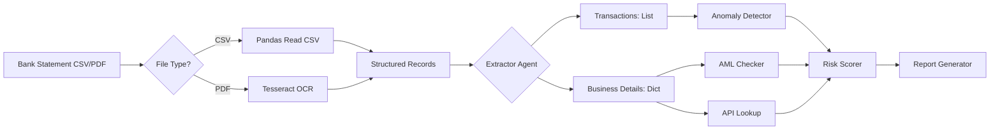

# Data Format Specifications

## Supported File Formats

| Format | Extensions | Max Size | Notes |
|--------|------------|----------|-------|
| CSV | `.csv` | 10 MB | UTF-8 encoded, header row required |
| PDF | `.pdf` | 10 MB | Text-based (not scanned images) |
| PDF (scanned) | `.pdf` | 10 MB | Requires Tesseract OCR (slower) |

---

## Bank Statement CSV Format

### Required Columns

| Column Name | Type | Description | Example |
|-------------|------|-------------|---------|
| `transaction_id` | int | Unique identifier per row | 1, 2, 3, ... |
| `date` | str | Transaction date (any parseable format) | 2025-07-01, 01/07/2025 |
| `amount` | float/str | Transaction amount (positive = credit, negative = debit) | 50000.00 |
| `description` | str | Transaction memo/description | "Invoice #123 Payment" |

### Optional Columns

| Column Name | Type | Description | Example |
|-------------|------|-------------|---------|
| `business_name` | str | Business name (if multi-business statement) | "Acme Pty Ltd" |
| `abn` | str | Australian Business Number | "123456789" |
| `counterparty` | str | Counterparty name | "Big Bank Ltd" |
| `counterparty_jurisdiction` | str | Country code of counterparty | "AU", "US", "XY" |
| `category` | str | Transaction category (income, expense) | "income" |
| `reference` | str | Transaction reference number | "REF123456" |

### Example CSV

```csv
transaction_id,date,amount,description,business_name,abn,counterparty_jurisdiction
1,2025-07-01,50000.00,Invoice #123 - Customer Payment,Acme Pty Ltd,123456789,AU
2,2025-07-02,12345.67,Supplier Payment - Office Supplies,Acme Pty Ltd,123456789,AU
3,2025-07-03,10000.00,Round-dollar transfer to related party,Shell Corp,999999999,XY
4,2025-07-04,750.50,Office Supplies - Stationery,Acme Pty Ltd,123456789,AU
```

### Multi-Business Statements

If the CSV contains multiple businesses, include `business_name` and `abn` columns. The system will group and analyze per business.

---

## Tax Return CSV Format

For demo purposes, tax returns can be simple CSVs. Real ATO extracts would be PDFs requiring OCR.

### Minimal Format

```csv
field,value
business_name,Acme Pty Ltd
abn,123456789
financial_year,2025
reported_revenue,750000.00
taxable_income,520000.00
address,123 Main St, Sydney NSW 2000
```

Alternatively, a single-row format:
```csv
business_name,abn,financial_year,reported_revenue,taxable_income,address
Acme Pty Ltd,123456789,2025,750000.00,520000.00,123 Main St, Sydney NSW 2000
```

**Note:** The system will also extract business details from the OCR'd text of a tax return PDF using regex patterns like:
- `ABN: 123456789`
- `Business Name: Acme Pty Ltd`
- `Address: ...`

---

## PDF Format

### Text-Based PDFs

- Searchable PDFs (e.g., digitally generated bank statements)
- Text is extracted directly using PyPDF2 or pdfminer (faster)
- Example: Online banking PDF export

### Scanned PDFs

- Image-based PDFs (scanned documents)
- Requires Tesseract OCR via pdf2image (slower)
- Ensure text is clear and not handwritten

### PDF Layout Assumptions

Our regex-based extractor looks for common bank statement patterns:
- Date formats: `DD/MM/YYYY` or `YYYY-MM-DD`
- Amounts: Prefixed with `$`, `£`, `€`, or no symbol
- Transactions listed line-by-line or in a table

**Unsupported layouts:**
- Vertical statement formats
- Handwritten receipts
- Multi-column newspaper-style layouts

---

## AML Watchlist JSON Format

File: `data/aml_watchlist.json`

```json
{
  "jurisdictions": ["XY", "ZW", "KP", "AF", "IQ", "SD"],
  "entities": ["Shell Corp", "Fake Biz", "Phantom Ltd", "Cash Business"],
  "abns": ["999999999", "888888888", "777777777"],
  "sanctioned_countries": ["XY", "ZW", "KP"],
  "high_risk_business_types": ["Money Service Business", "Casino", "Precious Metals Dealer"]
}
```

---

## Shell Company Indicators JSON

File: `data/shell_company_addresses.json`

```json
{
  "shell_indicators": [
    "PO Box",
    "Virtual Office",
    "Registered Agent",
    "Nominee Shareholder",
    "Bearer Shares",
    "No Physical Presence",
    "Mail Forwarding"
  ],
  "shell_addresses": [
    "Level 1, 123 Corporate St, Sydney NSW 2000",
    "PO Box 123, Melbourne VIC 3000"
  ]
}
```

---

## Validation Rules

### ABN Validation

ABNs must be 11 digits and satisfy the ABN checksum algorithm:

```python
def validate_abn(abn: str) -> bool:
    abn = abn.zfill(11)
    weights = [10, 1, 3, 5, 7, 9, 11, 13, 15, 17, 19]
    total = sum(int(d) * w for d, w in zip(abn, weights))
    return (total % 11) == 0
```

Our demo uses **mock ABNs**:
- `123456789` → valid
- `999999999` → invalid (shell company)
- `888888888` → suspended

**In production**, validate via ABR API lookup.

### Amount Validation

- Positive numbers only
- Cleaned of currency symbols (`$`, `,`)
- Range checked (0 < amount < 1,000,000,000)

### Date Validation

Accepts:
- `YYYY-MM-DD` (ISO 8601)
- `DD/MM/YYYY` (Australian)
- `MM/DD/YYYY` (US) – detected heuristically

Invalid dates → logged warning, skipped.

---

## Data Privacy & Sanitization

**All sample data should be synthetic** – never use real customer PII in production testing.

Sanitization rules applied:
- Real ABNs → replaced with fictional (`123456789`)
- Real names → `"Business_001"`
- Real addresses → `"123 Mock St, Sydney"`
- Real bank accounts → deleted or masked

**PII fields to redact if using real data:**
- Customer names
- Account numbers
- Full addresses
- Phone numbers
- Email addresses

---

## Data Flow Schema



---

## Sample Data Generator

The project includes a script to generate synthetic data:

```bash
python scripts/generate_sample_data.py
```

This creates:
- `data/sample_bank_statements.csv` (10 flagged transactions)
- `data/sample_tax_returns.csv` (1 business)
- `data/aml_watchlist.json` (mock watchlist)

---

## Edge Cases & Error Handling

### Missing Columns

If CSV is missing expected columns, the Data Extractor will:
1. Try case-insensitive column matching
2. Log warning
3. Skip that field (empty string)

### Corrupt PDFs

Will return empty text, logged as error. System continues with limited data.

### Empty Files

Raise `ValueError`: "File contains no data"

### Non-UTF8 CSVs

Attempt fallback encoding (latin-1, cp1252). Fail with clear error.

### Large Files (>10MB)

Rejected with HTTP 413. Increase `MAX_FILE_SIZE_MB` in `.env` if needed (not recommended).

---

## External Data Sources (Production)

When moving to production, integrate:

| Source | Data | Integration |
|--------|------|-------------|
| ABR (Australian Business Register) | ABN validation, business name, entity type | REST API (abn.business.gov.au) |
| ATO (Taxation Office) | Tax return verification, TFN | Standard Business Reporting (SBR) |
| AUSTRAC | Sanctions list, PEPs | Sanctions API (via third-party) |
| Credit Bureau | Credit history | Equifax/Experian API |
| Property valuation | Collateral value | APRA-regulated valuers |

---

## Versioning

Data formats are **backwards compatible**. If breaking changes needed, release major version bump (v2.0.0) and update `data_format.md`.

---

*Last updated: 2026-04-28*
